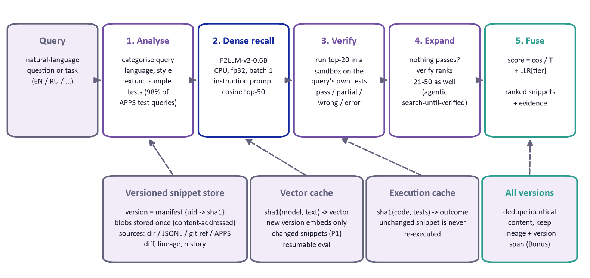
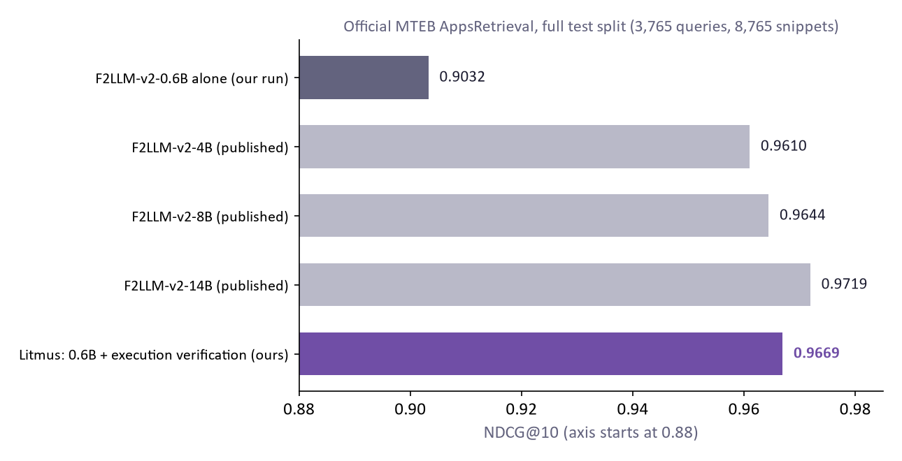
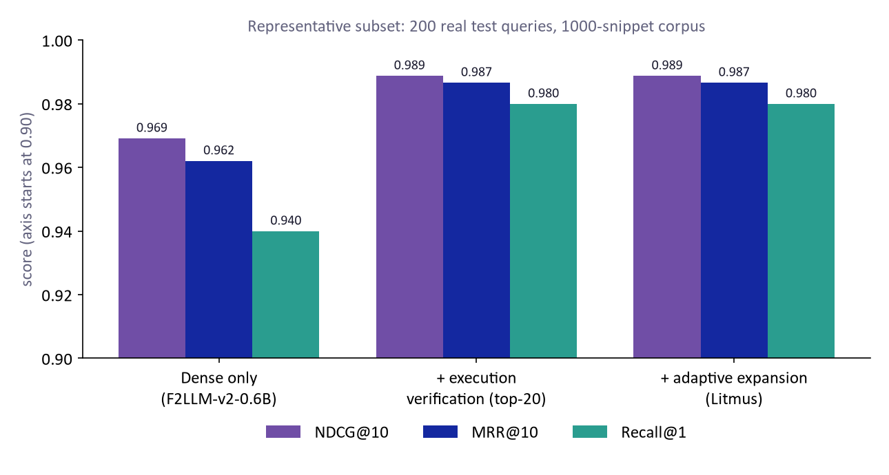
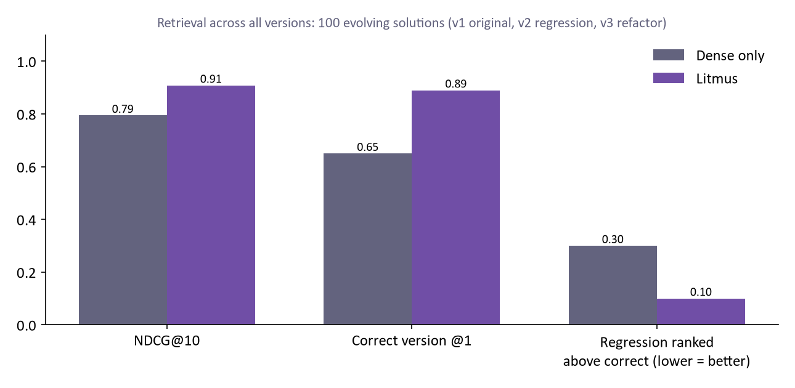

# Litmus: execution-verified, version-aware code retrieval

**Samsung PRISM Generative AI Hackathon 2026-27, Theme 1: Agentic Code Intelligence**

**Team Code Alchemist** (Thapar Institute of Engineering and Technology): Kanika Sahni, Abhinandan Wadhwa
· Demo video: [`demo/Video Project.mp4`](demo/Video%20Project.mp4)

> **Official result (MTEB AppsRetrieval, full test split):** NDCG@10 **0.9669**, MRR@10 **0.9604**,
> versus 0.9032 / 0.8828 for the same 0.6B embedding model without verification (see section 1.1).

> Given a library of code and a natural-language query, rank the code snippets by relevance.
> Runs on CPU. Supports retrieval over any version of the code base (P1) and across all
> versions (Bonus).

Litmus treats retrieval as *search followed by verification*. A dense retriever finds a
short-list, and then Litmus **checks** each candidate: when the query contains sample
tests (98.4% of CoIR-apps test queries do), the candidates are executed on those examples
in a sandbox. The evidence is fused into the ranking. A snippet that reproduces the
expected outputs is promoted; a look-alike that crashes or prints the wrong answer is
demoted. This also handles the hard part of the Bonus goal: two versions of a snippet
that are textually almost identical often *behave* differently.

<p align="center"></p>

---

## 1. Results

<!-- RESULTS:START -->
### 1.1 Official screening metric (MTEB AppsRetrieval, full test split)
Produced by `mteb.evaluate` (`scripts/run_mteb_eval.py`) on all 3,765 test queries against all 8,765 snippets. The files are in `results/` and attached to the v1.0.0 release.

| system | NDCG@10 | MRR@10 | Recall@1 | Recall@10 |
|---|---|---|---|---|
| F2LLM-v2-0.6B dense only (`PrePostPipelineEncoder`, guideline template) | 0.9032 | 0.8828 | 0.8303 | 0.9649 |
| **Litmus: dense + execution verification (`LitmusSearch`)** | **0.9669** | **0.9604** | **0.9408** | **0.9862** |

The dense-only run reproduces the published score of the same model (0.9045), which validates the setup. Verification lifts NDCG@10 by +0.0637 and cuts top-1 errors from 17.0% to 5.9%.

**Context.** In the public MTEB results repository (236 AppsRetrieval entries, snapshot 2026-09-30), the only entries above 0.9669 are google/gemini-embedding-2-preview (API) (0.9862), mongodb/voyage-4-large (API) (0.9746), codefuse-ai/F2LLM-v2-14B (0.9719). Litmus scores above F2LLM-v2-8B (0.9644) and F2LLM-v2-4B (0.9610) while using the 0.6B model. Leaderboard entries are single embedding models; Litmus is a retrieval pipeline (embedding + verification), so the comparison is informative rather than like-for-like.

*Hardware note:* to finish the one-off bulk embedding (about 12.5k texts) quickly, this run used a free Kaggle T4 GPU (`kaggle/litmus_official_eval.ipynb`). The model and fp32 precision are the same as on CPU, the sandbox ran on the CPU, and the product itself targets CPU (the demo runs entirely on a laptop CPU).

<p align="center"></p>

The official MTEB code path was verified end-to-end on the subset below (`scripts/smoke_mteb.py`, NDCG@10 0.9888, MRR@10 0.9867, produced by `mteb.evaluate`). This is a smoke test, not the screening score.

### 1.2 Representative subset: effect of each stage (P0)
200 real CoIR-apps **test** queries (random, seed 7) against a 1000-snippet corpus (their gold solutions + random real distractors). Same queries, same model, only the pipeline stage changes. A smaller corpus is easier than the official one, so compare rows, not leaderboard numbers.

| pipeline | NDCG@10 | MRR@10 | Recall@1 | Recall@10 | executions | wall time |
|---|---|---|---|---|---|---|
| dense_only | 0.9692 | 0.9621 | 0.9400 | 0.9900 | 0 | 0 s |
| verify_top20 | 0.9888 | 0.9867 | 0.9800 | 0.9950 | 3940 | 27 s |
| verify_top20_expand30 (Litmus) | 0.9888 | 0.9867 | 0.9800 | 0.9950 | 4630 | 5 s |

The runs execute in order and share the execution cache, so the last row only paid for the expansion executions. Adaptive expansion changed nothing here because recall@20 is already 0.995 on this corpus; it matters when the gold snippet sits below rank 20.

Ground truth at rank 1: 188/200 (dense) -> 196/200 (Litmus). Verification moved the ground truth **up in 9 queries and down in 0**.

Verification outcome of the *ground-truth* snippet (Litmus run): error: 5, not_verified: 4, pass_all: 173, pass_partial: 8, unverified: 2, wrong_answer: 8

<p align="center"></p>

### 1.3 Retrieval across versions: incremental rebuilds (P1)
| version | change | snippets | newly embedded | index (re)build |
|---|---|---|---|---|
| v1 | added 1000, removed 0, modified 0, unchanged 0 | 1000 | 0 | 0.08 s |
| v2 | added 0, removed 5, modified 50, unchanged 945 | 995 | 50 | 295.46 s |
| v3 | added 0, removed 0, modified 8, unchanged 987 | 995 | 0 | 0.05 s |

v1 was built from vectors already in the cache (the subset embedding step). Its cold cost is the one-off embedding of 1,000 snippets. The v2 time was measured while three other embedding processes were running, so it is pessimistic. The point is the *counts*: only the 50 changed snippets were embedded, and the v3 revert embedded none. The content-deduplicated all-versions view builds in 0.95 s.

### 1.4 Retrieval across all versions: evolutionary benchmark (Bonus)
100 gold solutions evolve through v1 (original, relevant), v2 (random single-point regression, not relevant) and v3 (behaviour-preserving refactor, relevant). We search the de-duplicated all-versions view (1199 items).

| system | NDCG@10 | MRR@10 | correct version @1 | regression ranked above correct |
|---|---|---|---|---|
| dense_only | 0.7944 | 0.8187 | 0.650 | 0.300 |
| litmus_exec_verified | 0.9085 | 0.9417 | 0.890 | 0.100 |

79.0% of the random regressions fail the query's sample tests. The rest are equivalent or untested mutations that no test-based method can separate.

<p align="center"></p>
<!-- RESULTS:END -->

### 1.5 Latency (warm server, i5-13500H laptop CPU, measured)

| query | embed query | dense search (1,000 snippets) | verify (sandbox) | total |
|---|---|---|---|---|
| new, unseen query, ~80 tokens (`demo/queries/custom_digit_sum.txt`) | 750 ms | 0.6 ms | 19 ms (50 candidates) | **0.77 s** |
| same query again (cached vector) | 0.1 ms | 0.4 ms | 1.7 ms | 2.4 ms |
| real test query q6018 (cached vector) | 0 ms | 0.7 ms | 21 ms (20 candidates) | 22 ms |

A ~330-token statement embeds in ~2.3 s (batch 1, fp32). Sandbox throughput during batch
evaluation was ~150 executions/s (3,940 candidate executions in 26.7 s).

---

## 2. How it works

### Pass 0: query analysis ("categorising the query")
`src/litmus/query_analysis.py` classifies the query as one of `task_with_examples`,
`task_spec`, `function_task` or `question`. It also detects the language (the APPS test
set contains Russian statements) and the statement style (Codeforces / AtCoder /
CodeChef / HackerRank / LeetCode), and **extracts the sample tests**. The extractor handles
`Examples` blocks, `Sample Input/Output` sections (numbered or not), AtCoder
explanations after the output, and Russian `Примеры` blocks. It deliberately does *not*
treat the Russian `Входные данные` *format* header as a sample. Coverage on the
CoIR-apps test split: **3,703 / 3,765 queries (98.4%)**, 2.13 examples on average.

### Pass 1: dense recall
[`codefuse-ai/F2LLM-v2-0.6B`](https://huggingface.co/codefuse-ai/F2LLM-v2-0.6B)
(Apache-2.0, Qwen3-based, last-token pooling) with the task instruction
`Instruct: Retrieve the most relevant code snippet for the given query.\nQuery: `.
We chose it from published MTEB `AppsRetrieval` scores (public `embeddings-benchmark/results`
repository) and our own CPU measurements:

| model (published AppsRetrieval NDCG@10) | params | our decision |
|---|---|---|
| F2LLM-v2-14B / 8B / 4B (0.972 / 0.964 / 0.961) | 4-14B | too slow for CPU |
| F2LLM-v2-1.7B (0.937) | 1.7B | ~3x slower than 0.6B on CPU |
| **F2LLM-v2-0.6B (0.905)** | **0.6B** | **chosen: best quality / CPU cost; AppsRetrieval not in its declared training data** |
| embeddinggemma-300m (0.844) | 0.3B | gated licence |
| F2LLM-v2-330M (0.839) | 0.33B | fallback "fast" option |

CPU engineering (i5-13500H, measured):

* The checkpoint is bf16. On CPUs without native bf16 that is emulated and very slow, so we
  load fp32.
* **Batch size 1 is 2.7x faster than batch 16** (163 vs 60 tok/s): padded, masked
  attention dominates on CPU. Snippets are encoded one at a time, longest first.
* Dynamic int8 quantisation was rejected (embedding cosine to fp32 = 0.13). OpenVINO fp32
  gave only +10%, so we kept plain PyTorch for portability.
* Every vector is cached under `sha1(model, role, instruction, text)` in SQLite:
  resumable, shared between runs and between code-base versions.

### Pass 2: execution verification
The top-20 candidates are executed on the query's sample inputs in a sandbox
(`src/litmus/sandbox.py`, `_sandbox_worker.py`):

* A pool of **persistent worker processes**, so a verification costs milliseconds rather
  than a process start-up. Every case runs in a fresh namespace.
* **fd-level stdin/stdout redirection**, so every judge idiom works: `input()`,
  `sys.stdin.read()`, `sys.stdin.buffer`, `open(0)`, `os.write(1, ...)`, `print`.
* **Isolation.** A PEP 578 audit hook, armed once and irremovable, blocks process
  creation, sockets, ctypes, registry access and any file write/delete outside a private
  temp dir. There is a per-case watchdog, a hard kill from the parent (covers C loops that
  hold the GIL), a memory cap (Windows Job Object / POSIX `RLIMIT_AS`), and workers are
  recycled.
* **Snippet normalisation for execution only** (`compat.py`). Snippets extracted from a
  function body (top-level `return`) are wrapped. Common Python-2 idioms (`print x`,
  `raw_input`, `xrange`, `except E, e`, ...) are rewritten. Removed APIs are shimmed
  (`fractions.gcd`, `np.float`). The indexed text is never modified.
* The output comparison is judge-style: whitespace-insensitive, case-insensitive words,
  float tolerance 1e-6.

Each candidate gets a **tier**: `pass_all`, `pass_partial` (typical for "print any valid
answer" problems), `unverified` (cannot run: Python 2 leftovers, missing modules),
`wrong_answer`, or `error` (crash / timeout).

### Pass 3: adaptive expansion (search-until-verified)
If none of the top-20 reproduces the examples, ranks 21-50 are verified as well. This is
an agent-style loop: keep looking until the evidence is found or the budget is spent.

### Evidence fusion
`score = cos(q, d) / T + LLR[tier]`, with `T = 0.02` and hand-set log-likelihood-ratio
priors `pass_all +7, pass_partial +1.5, unverified 0, wrong_answer -2, error -3`
(`src/litmus/verify.py`). They were set by hand and **never tuned on retrieval rankings**. For
full transparency: they were chosen after an execution-only feasibility study on 600 randomly
sampled test queries (`scripts/exec_feasibility.py`, `results/exec_feasibility.json`). That
study ran each gold snippet and five random snippets on the sample tests: **90.8% of gold
snippets pass all examples, versus 1 of 3,000 random snippets**. Fitting the weights on the
train split is future work. Unverifiable snippets
get exactly zero, so they are never punished for being old code. Queries without
examples skip passes 2-3 and are ranked by the dense score alone.

### P1: retrieval across versions (`store.py`, `engine.py`)
A version is a *manifest* `{snippet uid -> sha1(content)}`, like a git tree. Blobs,
vectors and execution results are all content-addressed. Adding a version (a full
snapshot, or a change set with `--partial`) therefore embeds only snippets whose content
is new: unchanged or reverted snippets cost nothing. Sources can be a directory
(one snippet per file, or AST-chunked into functions/classes), JSONL, the APPS corpus, or
**any git ref** (`git:REPO@REF`, read with `git show`, no checkout). You can query any
version by name (`--version v2`) or the latest; `diff` and `lineage` expose history.

### Bonus: evolutionary retrieval (`--version all`)
The all-versions view contains each *distinct* content once, annotated with its lineage
(`uid`) and the span of versions it appears in. Near-identical versions are exactly where
embeddings fail: a one-character regression has cosine ≈ 1 to the correct code.
Execution evidence separates them, and a tiny recency tie-break prefers the newest of
otherwise equivalent versions.

---

## 3. Setup

Tested on Windows 11, Python 3.12, CPU only (Intel i5-13500H, 16 GB RAM).

**Windows, no typing:** double-click `setup_windows.bat` once (installs everything into
`.venv`), then `run_demo.bat` (starts the web demo and opens the browser) or `run_tests.bat`.

**Any OS, manually:**

```bash
python -m venv .venv
# Windows: .venv\Scripts\activate    Linux/macOS: source .venv/bin/activate
pip install torch --index-url https://download.pytorch.org/whl/cpu
pip install -e .[dev]
pytest -q                                   # 16 tests, ~10 s, no model download needed
```

The first run downloads F2LLM-v2-0.6B (~2.4 GB) and the CoIR-apps dataset from Hugging Face.
All state lives in `LITMUS_HOME` (default `./.litmus`).

## 4. Running

**Fastest path (prebuilt demo index, no embedding wait):** download `litmus_demo_cache.zip`
from the GitHub release and unzip it in the repository root (it creates `.litmus/` with the
vectors, execution cache and the two demo stores), then run `litmus serve`.

**From scratch:**

```bash
# 1. build the demo store: 1,000 real CoIR-apps snippets, 3 versions (v1 -> v2 regression -> v3 fix)
python scripts/embed_subset.py          # embeds the representative subset (~25 min on a laptop CPU)
python scripts/build_demo.py            # creates store 'apps-demo' + demo/sample_queries.json

# 2. web demo (walkthrough: docs/DEMO.md)
litmus serve                            # http://127.0.0.1:8000

# 3. CLI
litmus search @demo/queries/q6018.txt --store apps-demo --version v1 -k 5 --code 8
litmus search @demo/queries/q5287.txt --store apps-demo --version all -k 5
litmus search @demo/queries/custom_digit_sum.txt --store apps-demo -k 3   # your own query
litmus versions apps-demo
litmus diff apps-demo v1 v2

# index your own code (P1): any directory or git ref, function-level chunks
litmus add-version myrepo v1 git:/path/to/repo@v1.0 --chunk function
litmus add-version myrepo v2 git:/path/to/repo@v2.0 --chunk function   # only changed functions are embedded
litmus search "where is the config parsed?" --store myrepo --version v1
```

## 5. Evaluation

```bash
python scripts/exec_feasibility.py   # does executing sample tests separate gold from random snippets?
python scripts/eval_subset.py        # representative subset: dense vs +verification vs +expansion
python scripts/smoke_mteb.py         # official mteb.evaluate path on the subset (integration check)
python scripts/eval_evolution.py     # Bonus: retrieval across all versions with regressions
python scripts/run_mteb_eval.py      # OFFICIAL: MTEB AppsRetrieval, full pipeline (SearchProtocol)
python scripts/run_mteb_eval.py --dense-only   # official template with an AbsEncoder (dense stage)
python docs/make_figures.py          # charts from results/*.json
```

**Faster official run on a free Kaggle GPU:** import `kaggle/litmus_official_eval.ipynb` into a
Kaggle notebook (it clones this repository), enable GPU + Internet, and choose *Run All*
(~45-75 min). The GPU only accelerates this one-off bulk embedding. The
model and fp32 precision are unchanged, so the numbers match a CPU run. The product itself
targets CPU (`LITMUS_DEVICE` defaults to `cpu`).

`run_mteb_eval.py` follows the guideline template (`mteb.get_task("AppsRetrieval")` →
`mteb.evaluate` → `task_result.to_dict()`). The full pipeline is passed to MTEB as a
`SearchProtocol` model, the same interface MTEB's own BM25 baseline uses, so MTEB computes
all metrics. Neither model reads query or document ids. On a laptop CPU the official run
takes ~6-7 h (it embeds 8,765 snippets and 3,765 long queries). It is resumable, and
`scripts/precompute_embeddings.py --shard i/3 --threads 4` parallelises it.

## 6. Repository structure

```
src/litmus/
  query_analysis.py   query categorisation + sample-test extraction
  embedder.py         F2LLM-v2-0.6B wrapper + content-addressed vector cache
  sandbox.py          persistent-worker execution sandbox + result cache
  _sandbox_worker.py  the worker process (audit-hook isolation, fd redirection, watchdog)
  compat.py           execution-time snippet normalisation (py2, wrapped bodies)
  verify.py           verification tiers + evidence fusion
  retriever.py        the multi-pass pipeline (single-query + batch)
  store.py            versioned content-addressed snippet store (P1 / Bonus)
  ingest.py           sources: directory, JSONL, git ref, APPS
  engine.py           wires everything; views per version / all versions
  evolve.py           AST refactor / mutation generator for version experiments
  mteb_integration.py PrePostPipelineEncoder (AbsEncoder) + LitmusSearch (SearchProtocol)
  server.py, web/     FastAPI + single-page demo UI
  cli.py              `litmus` command
scripts/              embedding, demo store, evaluations, official MTEB run
tests/                pytest suite (fake embedder: no model download)
results/              measured results (JSON/CSV)
docs/                 figures, demo walkthrough (DEMO.md), screenshots
presentation/         final PPT (Samsung PRISM template)
```

## 7. Limitations

* The official run's bulk embedding used a Kaggle GPU for speed (same fp32 model). A pure-CPU
  run of the same command takes ~6-7 h on a laptop; it was not repeated end-to-end on CPU.
* The subset corpus (1,000 snippets) is easier than the full corpus (8,765), so subset
  NDCG is not comparable with the leaderboard. The *relative* gain on identical queries is
  what it shows.
* Verification needs executable evidence in the query. Pure questions ("how is the input
  preprocessed?") fall back to dense ranking. Snippets that are not stand-alone programs
  (library functions) are `unverified`; function-call harnesses (LeetCode style) are
  future work.
* Problems with many valid outputs can make a correct solution fail exact comparison.
  They land in `pass_partial` / `wrong_answer`, which is why `wrong_answer` is only mildly
  penalised.
* The sandbox is defence-in-depth for benchmark and in-house code, not a boundary for
  hostile code. Use a container / gVisor for untrusted repositories.
* Latency is dominated by embedding the query with a 0.6B model on CPU (see 1.5). Loading
  the model takes ~35 s once per process; `litmus serve` does it at start-up.

## 8. Future work

Function-level test harnesses (call `Solution().method(...)`), generating extra test
inputs by mutating the sample inputs, fitting the fusion weights on the train split,
diff-aware ranking for "which version changed X" queries, ANN (HNSW) for million-snippet
code bases.

---

AI disclosure: see [AI_DISCLOSURE.md](AI_DISCLOSURE.md). Submission checklist: see
[SUBMISSION_CHECKLIST.md](SUBMISSION_CHECKLIST.md).
